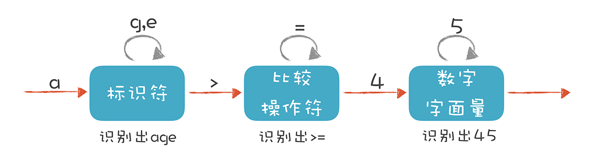
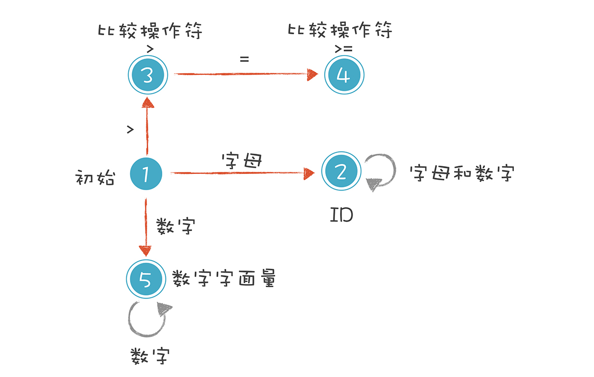

- [Linux 内存性能优化（讲师：倪朋飞）](#linux-%e5%86%85%e5%ad%98%e6%80%a7%e8%83%bd%e4%bc%98%e5%8c%96%e8%ae%b2%e5%b8%88%e5%80%aa%e6%9c%8b%e9%a3%9e)
  - [课程介绍](#%e8%af%be%e7%a8%8b%e4%bb%8b%e7%bb%8d)
  - [课程目录](#%e8%af%be%e7%a8%8b%e7%9b%ae%e5%bd%95)
  - [01 基础篇 Linux 内存是怎么工作的](#01-%e5%9f%ba%e7%a1%80%e7%af%87-linux-%e5%86%85%e5%ad%98%e6%98%af%e6%80%8e%e4%b9%88%e5%b7%a5%e4%bd%9c%e7%9a%84)
  - [02 基础篇 怎么理解内存中的 Buffer 和 Cache ？](#02-%e5%9f%ba%e7%a1%80%e7%af%87-%e6%80%8e%e4%b9%88%e7%90%86%e8%a7%a3%e5%86%85%e5%ad%98%e4%b8%ad%e7%9a%84-buffer-%e5%92%8c-cache)
    - [free 数据的来源](#free-%e6%95%b0%e6%8d%ae%e7%9a%84%e6%9d%a5%e6%ba%90)
    - [场景 1：磁盘和文件写案例](#%e5%9c%ba%e6%99%af-1%e7%a3%81%e7%9b%98%e5%92%8c%e6%96%87%e4%bb%b6%e5%86%99%e6%a1%88%e4%be%8b)
      - [写文件](#%e5%86%99%e6%96%87%e4%bb%b6)
      - [写磁盘](#%e5%86%99%e7%a3%81%e7%9b%98)
    - [场景 2：磁盘和文件读案例](#%e5%9c%ba%e6%99%af-2%e7%a3%81%e7%9b%98%e5%92%8c%e6%96%87%e4%bb%b6%e8%af%bb%e6%a1%88%e4%be%8b)
      - [读文件](#%e8%af%bb%e6%96%87%e4%bb%b6)
  - [03 案例篇：如何利用系统缓存优化程序的运行效率？](#03-%e6%a1%88%e4%be%8b%e7%af%87%e5%a6%82%e4%bd%95%e5%88%a9%e7%94%a8%e7%b3%bb%e7%bb%9f%e7%bc%93%e5%ad%98%e4%bc%98%e5%8c%96%e7%a8%8b%e5%ba%8f%e7%9a%84%e8%bf%90%e8%a1%8c%e6%95%88%e7%8e%87)
    - [缓存命中率](#%e7%bc%93%e5%ad%98%e5%91%bd%e4%b8%ad%e7%8e%87)
    - [指定文件的缓存大小](#%e6%8c%87%e5%ae%9a%e6%96%87%e4%bb%b6%e7%9a%84%e7%bc%93%e5%ad%98%e5%a4%a7%e5%b0%8f)
    - [案例一 dd](#%e6%a1%88%e4%be%8b%e4%b8%80-dd)
    - [案例二 文件读写](#%e6%a1%88%e4%be%8b%e4%ba%8c-%e6%96%87%e4%bb%b6%e8%af%bb%e5%86%99)
  - [04 案例篇：内存泄漏了，我该如何定位和处理？](#04-%e6%a1%88%e4%be%8b%e7%af%87%e5%86%85%e5%ad%98%e6%b3%84%e6%bc%8f%e4%ba%86%e6%88%91%e8%af%a5%e5%a6%82%e4%bd%95%e5%ae%9a%e4%bd%8d%e5%92%8c%e5%a4%84%e7%90%86)
    - [内存的分配与回收](#%e5%86%85%e5%ad%98%e7%9a%84%e5%88%86%e9%85%8d%e4%b8%8e%e5%9b%9e%e6%94%b6)
    - [案例](#%e6%a1%88%e4%be%8b)
- [深入浅出gRPC 讲师：李林锋](#%e6%b7%b1%e5%85%a5%e6%b5%85%e5%87%bagrpc-%e8%ae%b2%e5%b8%88%e6%9d%8e%e6%9e%97%e9%94%8b)
  - [内容简介](#%e5%86%85%e5%ae%b9%e7%ae%80%e4%bb%8b)
  - [内容目录](#%e5%86%85%e5%ae%b9%e7%9b%ae%e5%bd%95)
  - [01 gRPC 入门及服务端创建和调用原理](#01-grpc-%e5%85%a5%e9%97%a8%e5%8f%8a%e6%9c%8d%e5%8a%a1%e7%ab%af%e5%88%9b%e5%bb%ba%e5%92%8c%e8%b0%83%e7%94%a8%e5%8e%9f%e7%90%86)
    - [1.1 RPC 框架原理](#11-rpc-%e6%a1%86%e6%9e%b6%e5%8e%9f%e7%90%86)
  - [02 客户端创建和调用原理](#02-%e5%ae%a2%e6%88%b7%e7%ab%af%e5%88%9b%e5%bb%ba%e5%92%8c%e8%b0%83%e7%94%a8%e5%8e%9f%e7%90%86)
- [编译器前端原理入门: 了解词法分析、语法分析以及编译工具](#%e7%bc%96%e8%af%91%e5%99%a8%e5%89%8d%e7%ab%af%e5%8e%9f%e7%90%86%e5%85%a5%e9%97%a8-%e4%ba%86%e8%a7%a3%e8%af%8d%e6%b3%95%e5%88%86%e6%9e%90%e8%af%ad%e6%b3%95%e5%88%86%e6%9e%90%e4%bb%a5%e5%8f%8a%e7%bc%96%e8%af%91%e5%b7%a5%e5%85%b7)
  - [01 理解代码：编译器的前端技术](#01-%e7%90%86%e8%a7%a3%e4%bb%a3%e7%a0%81%e7%bc%96%e8%af%91%e5%99%a8%e7%9a%84%e5%89%8d%e7%ab%af%e6%8a%80%e6%9c%af)
    - [词法分析（Lexical Analysis）](#%e8%af%8d%e6%b3%95%e5%88%86%e6%9e%90lexical-analysis)
    - [语法分析 （Syntactic Analysis, or Parsing）](#%e8%af%ad%e6%b3%95%e5%88%86%e6%9e%90-syntactic-analysis-or-parsing)
    - [语义分析（Semantic Analysis）](#%e8%af%ad%e4%b9%89%e5%88%86%e6%9e%90semantic-analysis)
    - [课程小结](#%e8%af%be%e7%a8%8b%e5%b0%8f%e7%bb%93)
  - [02 正则文法和有限自动机：纯手工打造词法分析器](#02-%e6%ad%a3%e5%88%99%e6%96%87%e6%b3%95%e5%92%8c%e6%9c%89%e9%99%90%e8%87%aa%e5%8a%a8%e6%9c%ba%e7%ba%af%e6%89%8b%e5%b7%a5%e6%89%93%e9%80%a0%e8%af%8d%e6%b3%95%e5%88%86%e6%9e%90%e5%99%a8)
    - [解析 age &gt;= 45](#%e8%a7%a3%e6%9e%90-age-gt-45)


#  Linux 内存性能优化（讲师：倪朋飞）

https://time.geekbang.org/column/intro/251

## 课程介绍

我们都知道，内存管理机制用来管理系统和应用程序的指令、数据和缓存等，是操作系统核心的功能之一。内存管理可以让计算机对应用程序资源进行合理的分配与使用，以便保证系统的正常运行。

作为使用广泛的操作系统，Linux 管理内存的机制有其独特性，遇到的内存问题也常常会让我们感到困惑：

*   Buffer 和 Cache 的区别是什么？它们分别存储哪些数据？
*   内存泄漏时，如何定位？
*   Swap 变高的原因是什么？如何解决？

这个专栏带你从内存的原理入手，学习内存性能分析所需的基础知识和常见思路。在内容上划分为三个不同的篇章，让你一边学一边练：

*   基础篇，介绍内存的基本原理以及对应的性能指标和性能工具；
*   案例篇，通过上手实际案例，教你定位内存瓶颈，学会进一步分析并找出解决方案；
*   套路篇，概括内存性能问题通用的分析和优化套路。

倪朋飞，微软 Azure 资深工程师，主要负责开源容器编排系统 Kubernetes 在 Azure 的落地实践。他曾任职于盛大云和腾讯，一直从事云计算领域，特别专注于 IaaS 和容器技术。而近十年的云计算工作经验，也让他对 Linux 的系统原理、常见的性能问题以及优化方式了如指掌。

在专栏里，他将带你系统学习 Linux 内存性能优化，让你掌握常见的内存优化指标和工具，并通过实战总结出实用的内存优化方案，轻松解决 Linux 内存性能问题。

## 课程目录


- 01  基础篇：Linux内存是怎么工作的？
- 02  基础篇：怎么理解内存中的Buffer和Cache？
- 03  案例篇：如何利用系统缓存优化程序的运行效率？
- 04  案例篇：内存泄漏了，我该如何定位和处理？
- 05  案例篇：为什么系统的Swap变高了（上）
- 06  案例篇：为什么系统的Swap变高了？（下）
- 07  套路篇：如何“快准狠”找到系统内存的问题？

## 01 基础篇 Linux 内存是怎么工作的

## 02 基础篇 怎么理解内存中的 Buffer 和 Cache ？
https://time.geekbang.org/column/article/161667

### free 数据的来源

```
# 注意不同版本的 free 输出可能会有所不同
$ free
              total        used        free      shared  buff/cache   available
Mem:        8169348      263524     6875352         668     1030472     7611064
Swap:             0           0           0
```

缓存：内存中的临时存储，包含 Buffer 和 Cache

```
man free

buffers: Memory used by kernel buffers (Buffers in /proc/meminfo)
cache:  Memory used by the page cache and slabs (Cached and SReclaimable in /proc/meminfo)
buff/cache: Sum of buffers and cache
```

`/proc` 是Linux内核提供的一种特殊文件系统， 是用户跟内核交互的接口。


```

Buffers %lu
    Relatively temporary storage for raw disk blocks that shouldn't get tremendously large (20MB or so).

Cached %lu
   In-memory cache for files read from the disk (the page cache).  Doesn't include SwapCached.
...
SReclaimable %lu (since Linux 2.6.19)
    Part of Slab, that might be reclaimed, such as caches.
    
SUnreclaim %lu (since Linux 2.6.19)
    Part of Slab, that cannot be reclaimed on memory pressure.
```

机器配置
```
apt install sysstat
```

```
# 清理文件页、目录项、Inodes等各种缓存
$ echo 3 > /proc/sys/vm/drop_caches

# 每隔1秒输出1组数据
$ vmstat 1
procs -----------memory---------- ---swap-- -----io---- -system-- ------cpu-----
r  b   swpd   free   buff  cache   si   so    bi    bo   in   cs us sy id wa st
0  0      0 7743608   1112  92168    0    0     0     0   52  152  0  1 100  0  0
0  0      0 7743608   1112  92168    0    0     0     0   36   92  0  0 100  0  0
```
- buff 和 cache 就是我们前面看到的 Buffers 和 Cache，单位是 KB。
- bi 和 bo 则分别表示块设备读取和写入的大小，单位为块 / 秒。因为 Linux 中块的大小是 1KB，所以这个单位也就等价于 KB/s。

### 场景 1：磁盘和文件写案例

#### 写文件

```
# 通过读取随机设备，生成一个 500MB 大小的文件
$ dd if=/dev/urandom of=/tmp/file bs=1M count=500
```

通过观察 vmstat 的输出，我们发现，在 dd 命令运行时， Cache 在不停地增长，而 Buffer 基本保持不变。

再进一步观察 I/O 的情况，你会看到，
- 在 Cache 刚开始增长时，块设备 I/O 很少，bi 只出现了一次 488 KB/s，bo 则只有一次 4KB。而过一段时间后，才会出现大量的块设备写，比如 bo 变成了 122880。
- 当 dd 命令结束后，Cache 不再增长，但块设备写还会持续一段时间，并且，多次 I/O 写的结果加起来，才是 dd 要写的 500M 的数据。

#### 写磁盘

```
# 下面的命令对环境要求很高，需要你的系统配置多块磁盘，并且磁盘分区 /dev/sdb1 还要处于未使用状态。如果你只有一块磁盘，千万不要尝试，否则将会对你的磁盘分区造成损坏。
# 首先清理缓存
$ echo 3 > /proc/sys/vm/drop_caches
# 然后运行dd命令向磁盘分区/dev/sdb1写入2G数据
$ dd if=/dev/urandom of=/dev/sdb1 bs=1M count=2048
```


### 场景 2：磁盘和文件读案例

#### 读文件
```
# 首先清理缓存
$ echo 3 > /proc/sys/vm/drop_caches
# 运行dd命令读取文件数据
$ dd if=/tmp/file of=/dev/null
```

观察 vmstat 的输出，你会发现读取文件时（也就是 bi 大于 0 时），Buffer 保持不变，而 Cache 则在不停增长。这跟我们查到的定义“Cache 是对文件读的页缓存”是一致的。

```
# 首先清理缓存
$ echo 3 > /proc/sys/vm/drop_caches
# 运行dd命令读取文件
$ dd if=/dev/sda1 of=/dev/null bs=1M count=1024
```

观察 vmstat 的输出，你会发现读磁盘时（也就是 bi 大于 0 时），Buffer 和 Cache 都在增长，但显然 Buffer 的增长快很多。这说明读磁盘时，数据缓存到了 Buffer 中。

**Buffer 是对磁盘数据的缓存，而 Cache 是文件数据的缓存，它们既会用在读请求中，也会用在写请求中**


我们已经知道，可以使用 ps、top 或者 proc 文件系统，来获取进程的内存使用情况。那么，如何统计出所有进程的物理内存使用量呢？

提示：要避免重复计算多个进程同时占用的内存，像是页缓存、共享内存这类。如果你把 ps、top 得到的数据直接相加，就会出现重复计算的问题。

这里，我推荐从 /proc/< pid >/smaps 入手。前面内容里，我并没有直接讲过 /proc/< pid >smaps 文件中各个指标含义，所以，需要你自己动手查 proc 文件系统的文档，解读并回答这个问题。


## 03 案例篇：如何利用系统缓存优化程序的运行效率？ 

### 缓存命中率

命中率越高，表示使用缓存带来的收益越高，应用程序的性能也就越好。

cachestat 和 cachetop ，它们正是查看系统缓存命中情况的工具。
- cachestat 提供了整个操作系统缓存的读写命中情况。
- cachetop 提供了每个进程的缓存命中情况。

安装 `bcc` 软件包 https://github.com/iovisor/bcc

```sh
sudo apt-key adv --keyserver keyserver.ubuntu.com --recv-keys 4052245BD4284CDD
echo "deb https://repo.iovisor.org/apt/xenial xenial main" | sudo tee /etc/apt/sources.list.d/iovisor.list
sudo apt-get update
sudo apt-get install -y bcc-tools libbcc-examples linux-headers-$(uname -r)

$ export PATH=$PATH:/usr/share/bcc/tools
```


```sh
$ cachestat 1 3
   TOTAL   MISSES     HITS  DIRTIES   BUFFERS_MB  CACHED_MB
       2        0        2        1           17        279
       2        0        2        1           17        279
       2        0        2        1           17        279 
```
- TOTAL ，表示总的 I/O 次数；
- MISSES ，表示缓存未命中的次数；
- HITS ，表示缓存命中的次数；
- DIRTIES， 表示新增到缓存中的脏页数；
- BUFFERS_MB 表示 Buffers 的大小，以 MB 为单位；
- CACHED_MB 表示 Cache 的大小，以 MB 为单位。

```
$ cachetop
11:58:50 Buffers MB: 258 / Cached MB: 347 / Sort: HITS / Order: ascending
PID      UID      CMD              HITS     MISSES   DIRTIES  READ_HIT%  WRITE_HIT%
13029 root     python                  1        0        0     100.0%       0.0%
```

### 指定文件的缓存大小

指定文件在内存中的缓存大小。你可以使用 pcstat 这个工具，来查看文件在内存中的缓存大小以及缓存比例。

https://github.com/tobert/pcstat

```sh
$ export GOPATH=~/go
$ export PATH=~/go/bin:$PATH
$ go get golang.org/x/sys/unix
$ go get github.com/tobert/pcstat/pcstat
```

```sh
$ pcstat /bin/ls
+---------+----------------+------------+-----------+---------+
| Name    | Size (bytes)   | Pages      | Cached    | Percent |
|---------+----------------+------------+-----------+---------|
| /bin/ls | 133792         | 33         | 0         | 000.000 |
+---------+----------------+------------+-----------+---------+


$ ls
$ pcstat /bin/ls
+---------+----------------+------------+-----------+---------+
| Name    | Size (bytes)   | Pages      | Cached    | Percent |
|---------+----------------+------------+-----------+---------|
| /bin/ls | 133792         | 33         | 33        | 100.000 |
+---------+----------------+------------+-----------+---------+
```


### 案例一 dd

```

# 生成一个512MB的临时文件
$ dd if=/dev/sda1 of=file bs=1M count=512
# 清理缓存
$ echo 3 > /proc/sys/vm/drop_caches

# 确认刚刚生成的文件不在缓存中
$ pcstat file
+-------+----------------+------------+-----------+---------+
| Name  | Size (bytes)   | Pages      | Cached    | Percent |
|-------+----------------+------------+-----------+---------|
| file  | 536870912      | 131072     | 0         | 000.000 |
+-------+----------------+------------+-----------+---------+


# 每隔5秒刷新一次数据
$ cachetop 5


# 运行 dd 命令测试文件的读取速度
$ dd if=file of=/dev/null bs=1M
512+0 records in
512+0 records out
536870912 bytes (537 MB, 512 MiB) copied, 16.0509 s, 33.4 MB/s


# 查看 cachetop 界面的缓存命中情况
PID      UID      CMD              HITS     MISSES   DIRTIES  READ_HIT%  WRITE_HIT%
...
    3264 root     dd                  37077    37330        0      49.8%      50.2%

# 再次执行刚才的 dd 命令
$ dd if=file of=/dev/null bs=1M
512+0 records in
512+0 records out
536870912 bytes (537 MB, 512 MiB) copied, 0.118415 s, 4.5 GB/s

# 看看 cachetop 的情况
10:45:22 Buffers MB: 4 / Cached MB: 719 / Sort: HITS / Order: ascending
PID      UID      CMD              HITS     MISSES   DIRTIES  READ_HIT%  WRITE_HIT%
...
   32642 root     dd                 131637        0        0     100.0%       0.0%

# 再次执行 pcstat 查看文件 file 的缓存情况
$ pcstat file
+-------+----------------+------------+-----------+---------+
| Name  | Size (bytes)   | Pages      | Cached    | Percent |
|-------+----------------+------------+-----------+---------|
| file  | 536870912      | 131072     | 131072    | 100.000 |
+-------+----------------+------------+-----------+---------+
```


### 案例二 文件读写


接下来，我们再来看一个文件读写的案例。这个案例类似于前面学过的不可中断状态进程的例子。它的基本功能比较简单，也就是每秒从磁盘分区 /dev/sda1 中读取 32MB 的数据，并打印出读取数据花费的时间。

https://github.com/feiskyer/linux-perf-examples/tree/master/io-cached

```
# 每隔5秒刷新一次数据
$ cachetop 5 


$ docker run --privileged --name=app -itd feisky/app:io-direct


$ docker logs app
Reading data from disk /dev/sdb1 with buffer size 33554432
Time used: 0.929935 s to read 33554432 bytes
Time used: 0.949625 s to read 33554432 bytes

```


## 04 案例篇：内存泄漏了，我该如何定位和处理？

通过前几节对内存基础的学习，我相信你对 Linux 内存的工作原理，已经有了初步了解。

- 对普通进程来说，能看到的其实是内核提供的虚拟内存，这些虚拟内存还需要通过页表，由系统映射为物理内存。
- 当进程通过 malloc() 申请虚拟内存后，系统并不会立即为其分配物理内存，而是在首次访问时，才通过缺页异常陷入内核中分配内存。
- 为了协调 CPU 与磁盘间的性能差异，Linux 还会使用 Cache 和 Buffer ，分别把文件和磁盘读写的数据缓存到内存中。

### 内存的分配与回收

- 栈：举个例子，你在程序中定义了一个局部变量，比如一个整数数组`int data[64]`，就定义了一个可以存储 64 个整数的内存段。由于这是一个局部变量，它会从内存空间的栈中分配内存。栈内存由系统自动分配和管理。一旦程序运行超出了这个局部变量的作用域，栈内存就会被系统自动回收，所以不会产生内存泄漏的问题。
- 堆：再比如，很多时候，我们事先并不知道数据大小，所以你就要用到标准库函数`malloc()_`，_ 在程序中动态分配内存。这时候，系统就会从内存空间的堆中分配内存。堆内存由应用程序自己来分配和管理。除非程序退出，这些堆内存并不会被系统自动释放，而是需要应用程序明确调用库函数`free()`来释放它们。如果应用程序没有正确释放堆内存，就会造成内存泄漏。
- 只读段：包括程序的代码和常量，由于是只读的，不会再去分配新的内存，所以也不会产生内存泄漏。
- 数据段：包括全局变量和静态变量，这些变量在定义时就已经确定了大小，所以也不会产生内存泄漏。
- 最后一个内存映射段：包括动态链接库和共享内存，其中共享内存由程序动态分配和管理。所以，如果程序在分配后忘了回收，就会导致跟堆内存类似的泄漏问题。

**内存泄漏的危害非常大，这些忘记释放的内存，不仅应用程序自己不能访问，系统也不能把它们再次分配给其他应用。内存泄漏不断累积，甚至会耗尽系统内存。**

### 案例

接下来，我们就用一个计算斐波那契数列的案例，来看看内存泄漏问题的定位和处理方法。

环境准备

```sh
# install sysstat docker
sudo apt-get install -y sysstat docker.io

# Install bcc
sudo apt-key adv --keyserver keyserver.ubuntu.com --recv-keys 4052245BD4284CDD
echo "deb https://repo.iovisor.org/apt/bionic bionic main" | sudo tee /etc/apt/sources.list.d/iovisor.list
sudo apt-get update
sudo apt-get install -y bcc-tools libbcc-examples linux-headers-$(uname -r)
```

运行

```sh
# 运行fabonacci程序
$ docker run --name=app -itd feisky/app:mem-leak
# 查看log
$ docker logs app
2th => 1
3th => 2
4th => 3
5th => 5
6th => 8
7th => 13
# 查看内存使用的趋势

# 每隔3秒输出一组数据
$ vmstat 3
procs -----------memory---------- ---swap-- -----io---- -system-- ------cpu-----
r  b   swpd   free   buff  cache   si   so    bi    bo   in   cs us sy id wa st
procs -----------memory---------- ---swap-- -----io---- -system-- ------cpu-----
r  b   swpd   free   buff  cache   si   so    bi    bo   in   cs us sy id wa st
0  0      0 6601824  97620 1098784    0    0     0     0   62  322  0  0 100  0  0
0  0      0 6601700  97620 1098788    0    0     0     0   57  251  0  0 100  0  0
0  0      0 6601320  97620 1098788    0    0     0     3   52  306  0  0 100  0  0
0  0      0 6601452  97628 1098788    0    0     0    27   63  326  0  0 100  0  0
2  0      0 6601328  97628 1098788    0    0     0    44   52  299  0  0 100  0  0
0  0      0 6601080  97628 1098792    0    0     0     0   56  285  0  0 100  0  0 
```

从输出中你可以看到，内存的 free 列在不停的变化，并且是下降趋势；而 buffer 和 cache 基本保持不变。

未使用内存在逐渐减小，而 buffer 和 cache 基本不变，**这说明，系统中使用的内存一直在升高。但这并不能说明有内存泄漏，因为应用程序运行中需要的内存也可能会增大。比如说，程序中如果用了一个动态增长的数组来缓存计算结果，占用内存自然会增长。**


这里，我介绍一个专门用来检测内存泄漏的工具，`memleak`。`memleak` 可以跟踪系统或指定进程的内存分配、释放请求，然后定期输出一个未释放内存和相应调用栈的汇总情况（默认 5 秒）。

```sh

# -a 表示显示每个内存分配请求的大小以及地址
# -p 指定案例应用的PID号
$ /usr/share/bcc/tools/memleak -a -p $(pidof app)
WARNING: Couldn't find .text section in /app
WARNING: BCC can't handle sym look ups for /app
    addr = 7f8f704732b0 size = 8192
    addr = 7f8f704772d0 size = 8192
    addr = 7f8f704712a0 size = 8192
    addr = 7f8f704752c0 size = 8192
    32768 bytes in 4 allocations from stack
        [unknown] [app]
        [unknown] [app]
        start_thread+0xdb [libpthread-2.27.so] 
```
# 深入浅出gRPC 讲师：李林锋


专栏讲师 李林锋

《Netty 权威指南》、《分布式服务框架原理与实践》作者。

## 内容简介

“深入浅出 gRPC”是由《Netty 权威指南》和《分布式服务框架原理与实践》作者李林锋撰写并维护的系列文章。

由于支持移动端、多语言和 HTTP/2 等新特性，gRPC 在众多开源的 RPC 框架中脱颖而出，除了在谷歌内部长期使用，越来越多的公司也开始使用 gRPC 构建支持多语言的微服务框架。尽管 gRPC 的入门比较简单，但是如果对底层的工作原理以及 API 类库不太熟悉，在实际使用过程中也会遇到很多障碍。

本系列文章通过对服务端和客户端创建、服务调用、线程模型、安全和认证等功能模块的分析，从工作原理到核心代码都做了详细讲解，帮助读者更高效地掌握 gRPC 的实现细节，以便在工作中更好地应用和扩展，例如实现自定义的微服务安全策略，或者进行性能调优等等。

另外，考虑到 Java 相对其他编程语言来说应用比较广泛，所以文中的示例代码主要基于 Java 来展开讲解。

作者李林锋精通 Netty、Mina、分布式服务框架、API 开放和集成网关等技术，并有多年 Java NIO、平台中间件、PaaS 平台、API 网关设计和开发经验。

## 内容目录

- gRPC 入门及服务端创建和调用原理解析
- gRPC 客户端创建和调用原理解析
- gRPC 线程模型分析
- gRPC 服务调用原理分析
- gRPC 安全性设计
- gRPC 序列化机制

##  01  gRPC 入门及服务端创建和调用原理 

### 1.1 RPC 框架原理


1.2 业界主流的 RPC 框架

业界主流的 RPC 框架整体上分为三类：

1. 支持多语言的 RPC 框架，比较成熟的有 Google 的 gRPC、Apache（Facebook）的 Thrift；
2. 只支持特定语言的 RPC 框架，例如新浪微博的 Motan；
3. 支持服务治理等服务化特性的分布式服务框架，其底层内核仍然是 RPC 框架, 例如阿里的 Dubbo。

因此，基于多语言的 RPC 框架来构建微服务，是一种比较好的技术选择。例如 Netflix，API 服务编排层和后端的微服务之间就采用 gRPC 进行通信。


1.3.1 gRPC 概览

gRPC 是由 Google 开发并开源的一种语言中立的 RPC 框架，当前支持 C、Java 和 Go 语言，其中 C 版本支持 C、C++、Node.js、C# 等。


## 02 客户端创建和调用原理

gRPC 是在 HTTP/2 之上实现的 RPC 框架，HTTP/2 是第 7 层（应用层）协议，它运行在 TCP（第 4 层 - 传输层）协议之上，相比于传统的 REST/JSON 机制有诸多的优点：

1. 基于 HTTP/2 之上的二进制协议（Protobuf 序列化机制）；
2. 一个连接上可以多路复用，并发处理多个请求和响应；
3. 多种语言的类库实现；
4. 服务定义文件和自动代码生成（.proto 文件和 Protobuf 编译工具）。

此外，gRPC 还提供了很多扩展点，用于对框架进行功能定制和扩展，例如，通过开放负载均衡接口可以无缝的与第三方组件进行集成对接（Zookeeper、域名解析服务、SLB 服务等）。


# 编译器前端原理入门: 了解词法分析、语法分析以及编译工具


编译器前端技术，也就是通常所说的词法分析、语法分析和语义分析，是学习编译原理的第一站。了解基础技术理论并加以实践，运用工具提升编译工作效率，才能保持长期的竞争力。

宫文学，北京物演科技 CEO，连续创业者，2016 年入选厦门市第九批“双百计划”领军型创业人才。他是国内最早做 BPM（流程管理平台）和 BI（大数据平台）的创业者之一，之后也做过电子表单和快速开发平台，这些都与编译技术密不可分。

本专栏共 7 讲，从理解代码入手，详细讲解编译器前端技术中的词法分析和语法分析，理解其原理，并实现一门简单的脚本语言；了解 Antlr，学会使用它生成词法分析器和语法分析器，提升编译工作效率并重构脚本语言。

https://time.geekbang.org/column/intro/261

本专栏节选自宫文学的[《编译原理之美》](https://time.geekbang.org/column/intro/219?utmterm=zeus22IQD&utmsource=huodong&utmmedium=geektime&utmcampaign=xiaozhuanlanzudui&utm_content=textlink1212)，在专栏中，从前端与后端两个层面来讲解编译原理的核心技术点，用具体的案例带你理解抽象的原理，在工作中真正用到编译技术。

通过这门课，你不仅能实现写出一个编译器的愿望，还能通过 SQL 解析器、报表工具、字节码生成等小练习锻炼动手能力。

专栏共 38 讲，用简洁清晰的示意图 + 实战项目案例，带你深入剖析编译原理的实际应用，只要沉下心去学习研究，掌握编译技术指日可待！

[戳此立即加入学习 >>>](https://time.geekbang.org/column/intro/219?utmterm=zeus22IQD&utmsource=huodong&utmmedium=geektime&utmcampaign=xiaozhuanlanzudui&utm_content=textlink1212)


## 01  理解代码：编译器的前端技术


这里的“前端（Front End）”指的是编译器对程序代码的分析和理解过程。它通常只跟语言的语法有关，跟目标机器无关。而与之对应的“后端（Back End）”则是生成目标代码的过程，跟目标机器有关。为了方便你理解，我用一张图直观地展现了编译器的整个编译过程。


### 词法分析（Lexical Analysis）

通常，编译器的第一项工作叫做词法分析。就像阅读文章一样，文章是由一个个的中文单词组成的。程序处理也一样，只不过这里不叫单词，而是叫做“词法记号”，英文叫 `Token`。我嫌“词法记号”这个词太长，后面直接将它称作 `Token` 吧。


如果嫌手写麻烦，或者你想花更多时间陪恋人或家人，也可以偷点儿懒，用词法分析器的生成工具来生成，比如 Lex（或其 GNU 版本，Flex）。这些生成工具是基于一些规则来工作的，这些规则用“正则文法”表达，符合正则文法的表达式称为“正则表达式”。生成工具可以读入正则表达式，生成一种叫“有限自动机”的算法，来完成具体的词法分析工作。

不要被“正则文法（Regular Grammar）”和“有限自动机（Finite-state Automaton，FSA，or Finite Automaton）”吓到。正则文法是一种最普通、最常见的规则，写正则表达式的时候用的就是正则文法。我们前面描述的几个规则，都可以看成口语化的正则文法。

有限自动机是有限个状态的自动机器。我们可以拿抽水马桶举例，它分为两个状态：“注水”和“水满”。摁下冲马桶的按钮，它转到“注水”的状态，而浮球上升到一定高度，就会把注水阀门关闭，它转到“水满”状态。


词法分析器也是一样，它分析整个程序的字符串，当遇到不同的字符时，会驱使它迁移到不同的状态。例如，词法分析程序在扫描 age 的时候，处于“标识符”状态，等它遇到一个 > 符号，就切换到“比较操作符”的状态。词法分析过程，就是这样一个个状态迁移的过程。


### 语法分析 （Syntactic Analysis, or Parsing）

编译器下一个阶段的工作是语法分析。词法分析是识别一个个的单词，而语法分析就是在词法分析的基础上识别出程序的语法结构。这个结构是一个树状结构，是计算机容易理解和执行的。


程序也有定义良好的语法结构，它的语法分析过程，就是构造这么一棵树。一个程序就是一棵树，这棵树叫做**抽象语法树（Abstract Syntax Tree，AST）**。树的每个节点（子树）是一个语法单元，这个单元的构成规则就叫“语法”。每个节点还可以有下级节点。


```

clang -cc1 -ast-dump hello.c
```


如果你觉得这棵树还不够直观，可以参考我提供的网址，它能够生成 JavaScript 语言的 AST，并以更加直观的方式呈现。
https://resources.jointjs.com/demos/javascript-ast


**形成 AST 以后有什么好处呢？就是计算机很容易去处理。**比如，针对表达式形成的这棵树，从根节点遍历整棵树就可以获得表达式的值。基于这个原理，我在后面的课程中会带你实现一个计算器，并实现自定义公式功能。

递归下降算法（Recursive Descent Parsing）是一种自顶向下的算法，与之对应的，还有自底向上的算法。这个算法会先将最下面的叶子节点识别出来，然后再组装上一级节点。有点儿像搭积木，我们总是先构造出小的单元，然后再组装成更大的单元。原理就是这么简单。


你现在已经有了一定的经验，大可以去找找看有没有现成的工具，比如 Yacc（或 GNU 的版本，Bison）、Antlr、JavaCC 等。实际上，你可以在维基百科里找到一个挺大的清单，我把它放到了 [CSDN 的博客](https://blog.csdn.net/gongwx/article/details/99645305)上，其中对各种工具的特性做了比较。


### 语义分析（Semantic Analysis）

你可能会觉得理解自然语言的含义已经很难了，所以计算机语言的语义分析也一定很难。其实语义分析没那么复杂，因为计算机语言的语义一般可以表达为一些规则，你只要检查是否符合这些规则就行了。比如：

- 某个表达式的计算结果是什么数据类型？如果有数据类型不匹配的情况，是否要做自动转换？
- 如果在一个代码块的内部和外部有相同名称的变量，我在执行的时候到底用哪个？ 就像“我喜欢又聪明又勇敢的你”中的“你”，到底指的是谁，需要明确。
- 在同一个作用域内，不允许有两个名称相同的变量，这是唯一性检查。你不能刚声明一个变量 a，紧接着又声明同样名称的一个变量 a，这就不允许了。

语义分析基本上就是做这样的事情，也就是根据语义规则进行分析判断。

### 课程小结

讲完语义分析，本节课也就告一段落了，我来总结一下本节课的重点内容：

- 词法分析是把程序分割成一个个 Token 的过程，可以通过构造有限自动机来实现。
- 语法分析是把程序的结构识别出来，并形成一棵便于由计算机处理的抽象语法树。可以用递归下降的算法来实现。
- 语义分析是消除语义模糊，生成一些属性信息，让计算机能够依据这些信息生成目标代码。

## 02 正则文法和有限自动机：纯手工打造词法分析器


我们手工打造词法分析器的过程，就是写出正则表达式，画出有限自动机的图形，然后根据图形直观地写出解析代码的过程。而我今天带你写的词法分析器，能够分析以下 3 个程序语句：

- `age >= 45`
- `int age = 40`
- `2+3*5`

它们分别是关系表达式、变量声明和初始化语句，以及算术表达式。


### 解析 age >= 45

在“01 理解代码：编译器的前端技术”里，我举了一个词法分析的例子，并且提出词法分析要用到有限自动机。当时，我画了这样一个示意图：




一个严格意义上的有限自动机(Finite-state Automaton)是下面这种画法：




我来解释一下上图的 5 种状态。

1. 初始状态：刚开始启动词法分析的时候，程序所处的状态。
2. 标识符状态：在初始状态时，当第一个字符是字母的时候，迁移到状态 2。当后续字符是字母和数字时，保留在状态 2。如果不是，就离开状态 2，写下该 Token，回到初始状态。
3. 大于操作符（GT）：在初始状态时，当第一个字符是 > 时，进入这个状态。它是比较操作符的一种情况。
4. 大于等于操作符（GE）：如果状态 3 的下一个字符是 =，就进入状态 4，变成 >=。它也是比较操作符的一种情况。
5. 数字字面量：在初始状态时，下一个字符是数字，进入这个状态。如果后续仍是数字，就保持在状态 5。


这里我想补充一下，你能看到上图中的圆圈有单线的也有双线的。双线的意思是这个状态已经是一个合法的 Token 了，单线的意思是这个状态还是临时状态。

```java
DfaState newState = DfaState.Initial;
if (isAlpha(ch)) {              //第一个字符是字母
    newState = DfaState.Id; //进入Id状态
    token.type = TokenType.Identifier;
    tokenText.append(ch);
} else if (isDigit(ch)) {       //第一个字符是数字
    newState = DfaState.IntLiteral;
    token.type = TokenType.IntLiteral;
    tokenText.append(ch);
} else if (ch == '>') {         //第一个字符是>
    newState = DfaState.GT;
    token.type = TokenType.GT;
    tokenText.append(ch);
}
```

