<!-- TOC -->

- [Links](#links)
- [Pre-Kickoff and Introduction - Day 0: April 21](#pre-kickoff-and-introduction---day-0-april-21)
    - [Agenda](#agenda)
    - [Notes](#notes)
    - [Upcoming Events Briefing](#upcoming-events-briefing)
    - [System Overview (timestamp: 24:45)](#system-overview-timestamp-2445)
    - [Access to Z & Machine Learning Code Lab (timestamp: 1:05:00)](#access-to-z--machine-learning-code-lab-timestamp-10500)
- [Kickoff Day - Day 1: April 22](#kickoff-day---day-1-april-22)
    - [Agenda](#agenda)
    - [Design Thinking (Tyler King & Ademola Olajide Ajayi)](#design-thinking-tyler-king--ademola-olajide-ajayi)

<!-- /TOC -->

## Links

- [https://codethecurve.ihackonline.com/workshop%20forms/hack-resources/](https://codethecurve.ihackonline.com/workshop%20forms/hack-resources/)

## Pre-Kickoff and Introduction - Day 0: April 21

[Youtube Video Link](https://www.youtube.com/watch?v=Ld9RebKEmpY&feature=youtu.be)

### Agenda
- Core Team Kickoff
- System Overview
- Access to Z & Machine Learning Code Lab
- Core Team Clsoe for Day 0 & Next Steps for Day 1

### Notes

Melissa Sassi (IBM)
- IBM Z Student Hub
- scrappy tech projects, hhhh
- Core team of CodeTheCurve
- Things small might ended up big, and it's up to you to change the world :smile:
- Experiences of Hackathon as a team leader, finally pitched to Microsoft CEO

Davide Storti (UNESCO)
- Italy

Ademola Ajayi (SAP)

- Team manager of SAP HANA
- Design thinking coach
- Founder of some interesting projects
- Fail fast, fail better

Sudharsana Srinivasan (IBM)

- Developer and student engagement on IBM Z

### Upcoming Events Briefing 

Day 2:

- ...

Day 3 (Apr 24, Fri)

- Machine Learning, AI
- "Call for Code" Hackathon

Day 4 (April 25, Sat)

- Pitching best practices
- You should be building your solution from this day

Day 5 (Apr 26, Sun)

- Rehearsal of pitching
- 3-min pitch, 2-min feedback
- Submission time:  11:59 PM Easter Standard Time April 26th (New York time)
- Teams from 32 different countries

### System Overview (timestamp: 24:45)

iHack Online (Joanne)

- https://codethecurve.ihackonline.com/codethecurve-hackathon/
- Your Teams namespace
- Getting feedback
- Submit Pitch

Prices

- SAP Internship
- Mentorship
- Unknown surprises ...

Ask questions

- No question is the most stupid question
- Feel comfortable to ask silly questions
- Use translations if you're struggling to ask questions in non-native language

### Access to Z & Machine Learning Code Lab (timestamp: 1:05:00)

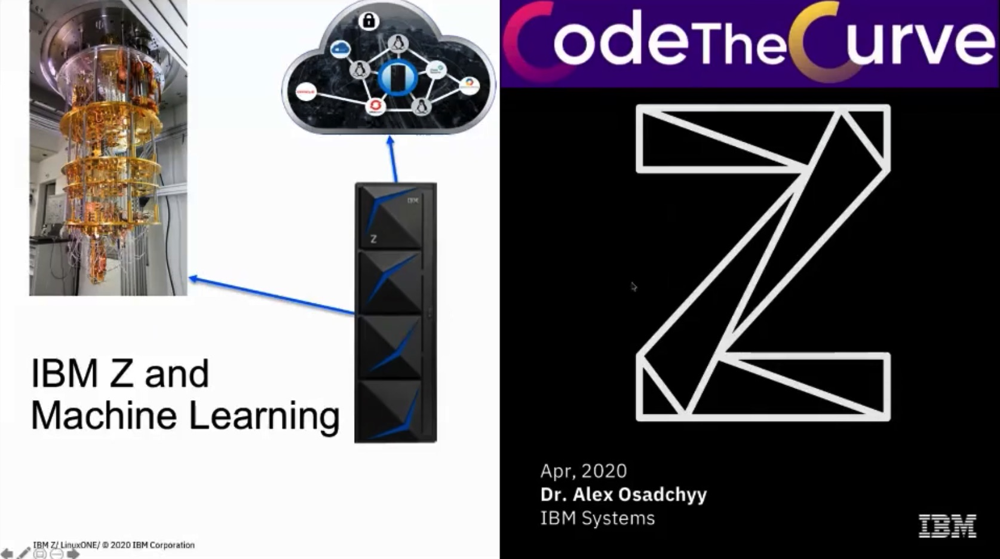

- Dr. Alex Osadchyy
  - Sr. Solution Architect
  - Career Paths: Java/PaaS/Docker/pySpark/IBM Z

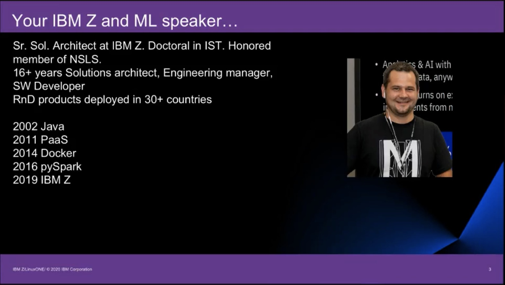

- IBM Z
  - Modern Mainframe
  - Support Huge amounts of transactions
  - Increasing computing power and functionality
  - cost for per transaction , not the cost for actual virtual machine
- Introducing IBM z15(tm) / LinuxOne III
  - two million docker containers on one machine

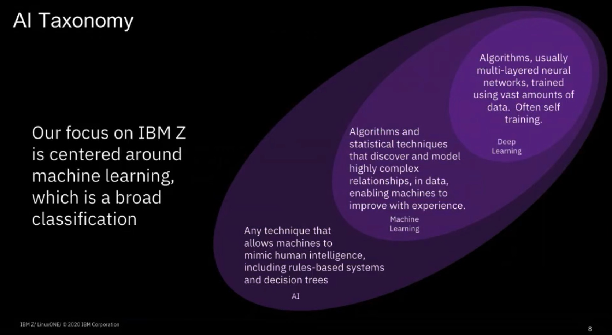

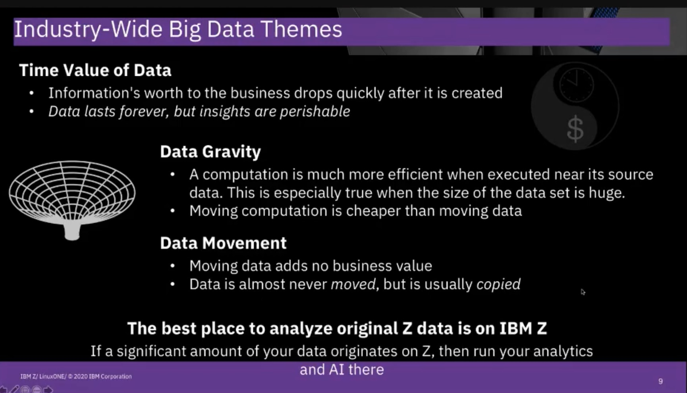

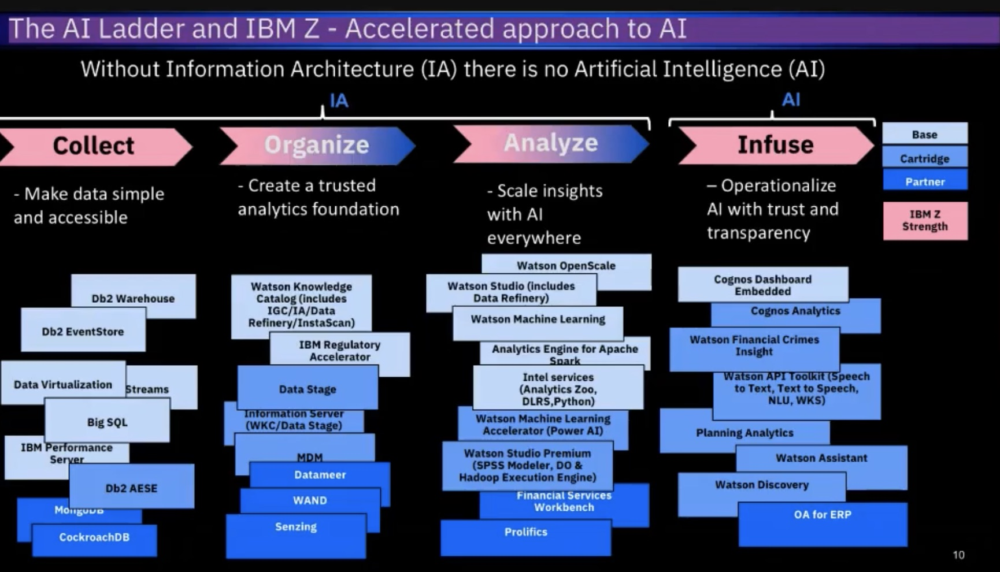

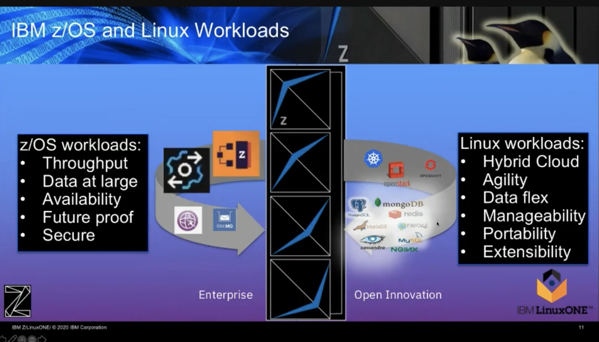

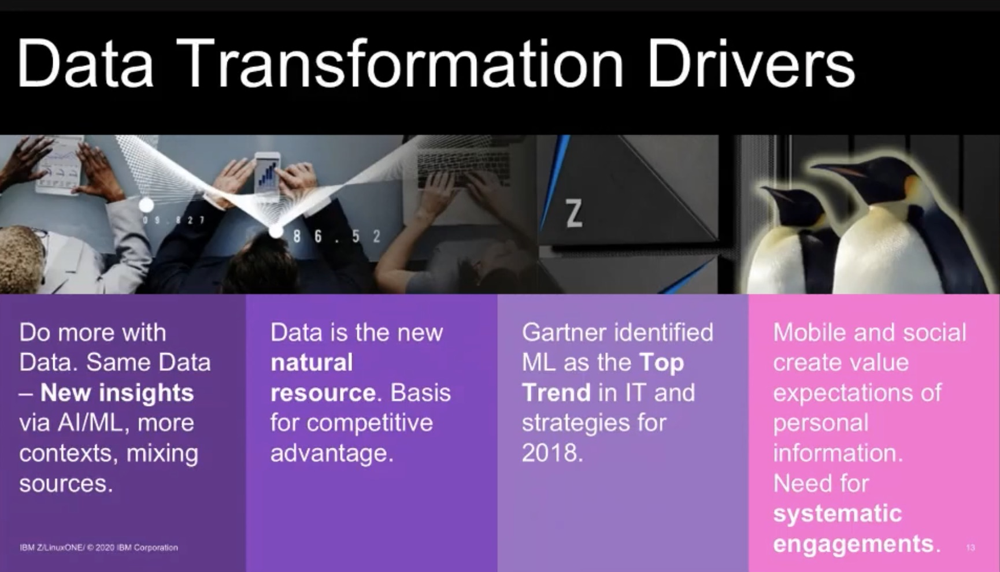

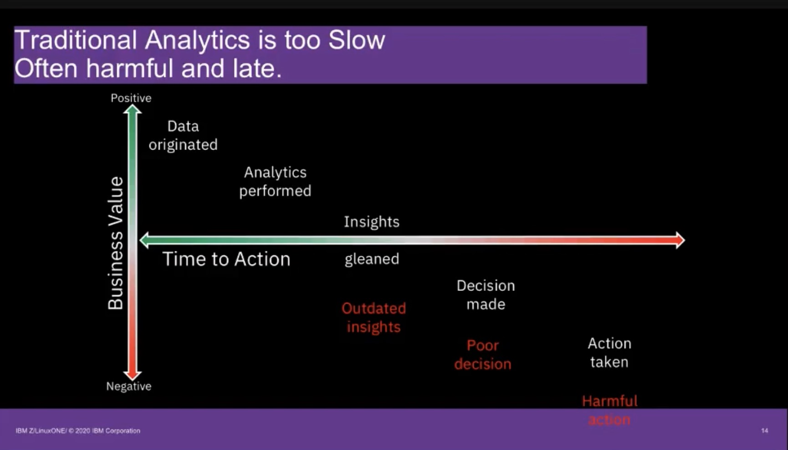

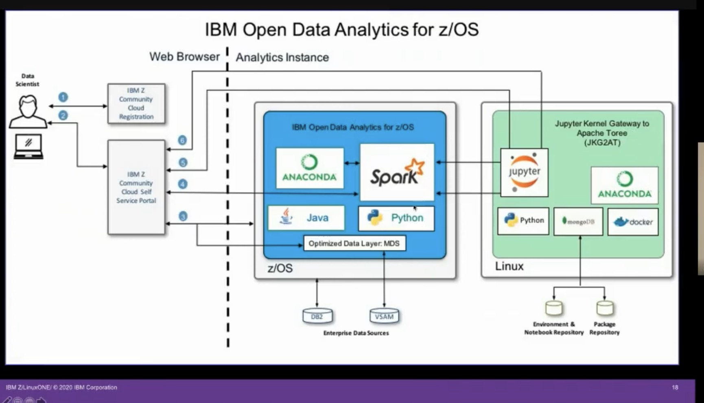

Demo (Timestamp: 1:39:00)

- [https://zcloud.marist.edu](https://zcloud.marist.edu)
- [https://github.com/ibmz-community-cloud/zAnalytics/blob/master/README.md](https://github.com/ibmz-community-cloud/zAnalytics/blob/master/README.md)

 IBM Waston Studio

- [https://www.ibm.com/cloud/watson-studio](https://www.ibm.com/cloud/watson-studio)
- Auto AI
- Price: [https://www.ibm.com/cloud/watson-studio/pricing](https://www.ibm.com/cloud/watson-studio/pricing)

| Pricing plan                                                 | Features                                  | Price |                                                              |
| :----------------------------------------------------------- | :---------------------------------------- | :---- | :----------------------------------------------------------- |
| **Watson Studio Cloud – Lite** — for individuals looking to get started with Watson Studio | 50 capacity unit hours per month included | Free  | [Start for free](https://dataplatform.cloud.ibm.com/registration/stepone?apps=all&context=wdp) |

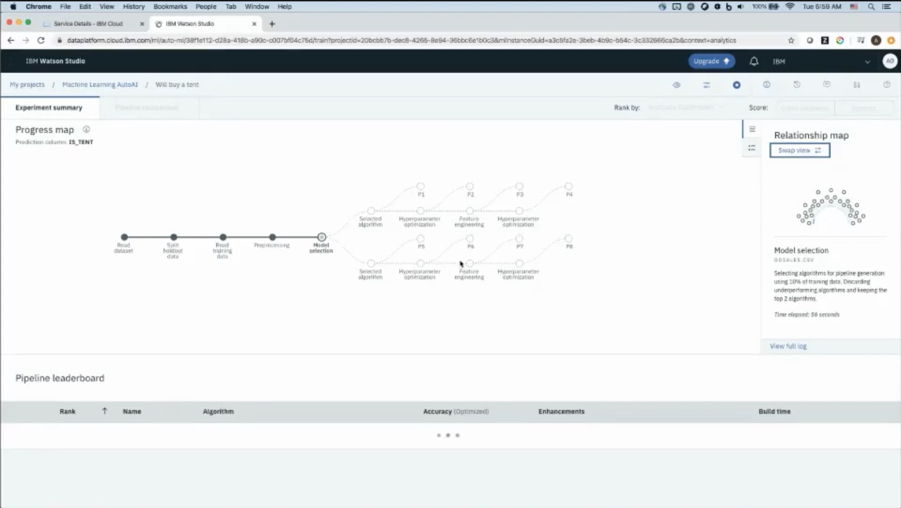

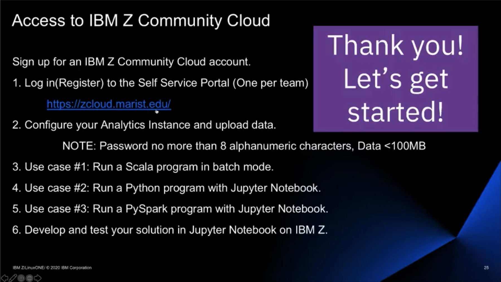

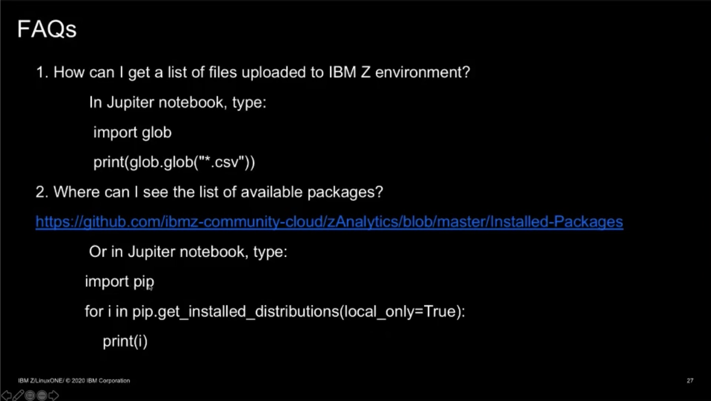

## Kickoff Day - Day 1: April 22

### Agenda

- Design Thinking (Tyler King & Ademola Olajide Ajayi)
- Building Cross-Functional Teams &I Conflict Resolution (Gavin Heaton
- Storytelling & Personal Breaking (Miri Rodriguez)
- Imposter Syndrome (Melissa Sassi)
- Purpose-Driven Career

### Design Thinking (Tyler King & Ademola Olajide Ajayi)

Presenter: Tyler King

The TV Drama: Silicon Valley

